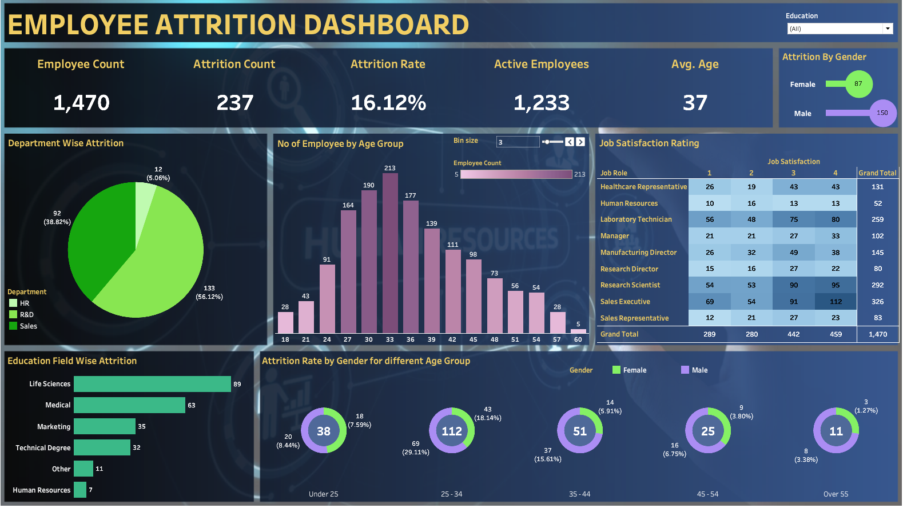

# Tableau EMPLOYEE ATTRITION DASHBOARD

## Overview
This repository contains an EMPLOYEE ATTRITION Dashboard created using Tableau Public. The dashboard provides insights into various aspects of EMPLOYEE ATTRITION, including employee count, attrition rates, age distribution, job satisfaction, and more. It is designed to help HR professionals make data-driven decisions to improve workforce management and employee satisfaction.

## Objectives
The primary objectives of this dashboard are to:
- Visualize key HR metrics such as employee count, attrition rate, and active employees.
- Analyze department-wise and education field-wise attrition.
- Provide insights into employee age distribution and attrition rates by gender.
- Present job satisfaction ratings across different job roles.

## Sheet Wise Overview:
1. Key Performance Indicators (KPIs): Displays critical metrics such as overall attrition rate, average job satisfaction score, and average employee tenure.
2. Employee Count: Displays the total number of employees.
3. Attrition Count: Shows the number of employees who have left the organization.
4. Attrition Rate: Indicates the percentage of employees who have left.
5. Active Employees: Current number of employees.
6. Average Age: Average age of employees.
7. Department Wise Attrition: Pie chart depicting attrition rates across different departments.
8. Number of Employees by Age Group: Bar chart showing the distribution of employees across various age groups.
9. Job Satisfaction Rating: Heatmap illustrating job satisfaction across different job roles.
10. Education Field Wise Attrition: Horizontal bar chart displaying attrition rates across various educational backgrounds.
11. Attrition Rate by Gender for Different Age Groups: Pie charts showing gender-wise attrition rates for various age groups.

## Visualizations
The dashboard includes the following visualizations:
- **Employee Count, Attrition Count, Attrition Rate, Active Employees, and Average Age**: Key metrics displayed at the top of the dashboard.
- **Department Wise Attrition**: A pie chart showing the distribution of attrition across different departments.
- **No of Employee by Age Group**: A bar chart displaying the number of employees in different age groups.
- **Job Satisfaction Rating**: A table showing job satisfaction ratings across various job roles.
- **Education Field Wise Attrition**: A bar chart illustrating attrition rates across different education fields.
- **Attrition Rate by Gender for Different Age Groups**: Donut charts showing attrition rates by gender for different age groups.

### Accessing the Dashboard
1. Click on the link above to access the dashboard on Tableau Public.
2. Use the interactive filters and controls to explore different aspects of the data.
3. View the dashboard in full-screen mode for the best experience.

## Files
- `HR_Dash.png`: The image of the dashboard.
- `HR background.pptx (1).png`: The PowerPoint slide used as the background for the dashboard.

## Contributing
Contributions to improve the dashboard or add new features are welcome. Please fork the repository and create a pull request with your changes.

## Link to Dashboard
You can view the full dashboard on Tableau Public [here](https://public.tableau.com/app/profile/pratiksha.gadhe/viz/HR_ANALYTICS_DASHBOARD1_twbx/HRANALYTICSDASHBOARD).

